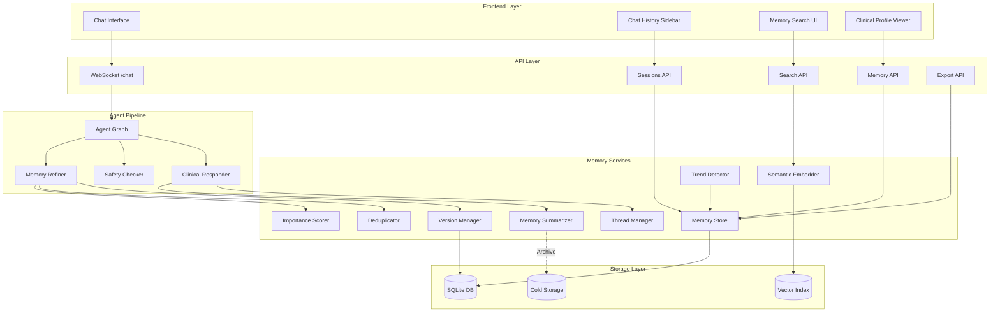

# Design Document: Enhanced Chat and Memory

## Overview

The Enhanced Chat and Memory feature extends CareAnchor's clinical assistant capabilities by adding intelligent memory management, conversation organization, and advanced search capabilities. The current system maintains a simple append-only chat log and a flat clinical profile structure. This enhancement introduces memory summarization to manage context windows, importance scoring to prioritize critical clinical information, semantic search for natural language queries, conversation threading for topic organization, and versioning for data integrity.

The system will continue to use the existing SQLite database with schema extensions, integrate with the current LangGraph agent pipeline, and leverage the existing chat sidebar UI as a foundation. New components include a memory summarization service, a semantic embedding service, a trend analysis module, and expanded REST APIs for search and export functionality.

**Key Design Goals:**
- Maintain backward compatibility with existing chat and memory infrastructure
- Keep context windows under 4000 tokens for LLM efficiency
- Prioritize clinically critical information in memory retrieval
- Enable natural language search across conversation history
- Provide audit trail through memory versioning
- Support data privacy through selective redaction
- Manage storage costs through intelligent retention policies

## Architecture

### High-Level System Architecture




### Component Responsibilities

**Frontend Components:**
- **Chat Interface**: Existing chat UI extended with thread indicators and importance badges
- **Chat History Sidebar**: Existing sidebar enhanced with search bar and thread filtering
- **Memory Search UI**: New component for semantic search across conversation history
- **Clinical Profile Viewer**: Existing component enhanced with trend visualization

**API Endpoints:**
- **WebSocket /chat**: Existing streaming endpoint, unchanged
- **Sessions API**: Existing session management, extended with metadata
- **Memory API**: New endpoint for memory versioning, redaction, and manual operations
- **Search API**: New endpoint for semantic search queries
- **Export API**: New endpoint for conversation export in multiple formats

**Agent Pipeline:**
- **Agent Graph**: Existing LangGraph orchestrator, extended with summarization trigger
- **Memory Refiner**: Existing extraction agent, extended with importance scoring
- **Clinical Responder**: Existing response generator, modified to use summarized context
- **Safety Checker**: Existing vital sign monitor, unchanged

**Memory Services:**
- **Memory Store**: Existing persistence layer, extended with new tables and queries
- **Memory Summarizer**: New service that compresses old messages into summaries
- **Importance Scorer**: New service that assigns clinical relevance scores
- **Semantic Embedder**: New service that generates vector embeddings for search
- **Thread Manager**: New service that groups messages by topic
- **Trend Detector**: New service that analyzes time-series clinical data
- **Version Manager**: New service that creates and manages profile snapshots
- **Deduplicator**: New service that detects and merges duplicate entries

### Integration Points

**Existing Chat Sidebar Integration:**
The current `ChatHistorySidebar` component will be extended with:
- Search input field at the top of the sidebar
- Thread badges on conversation entries
- Importance indicators (colored dots) for high-priority sessions
- Export button on session hover

**Existing Memory Store Integration:**
The current `MemoryStore` class will be extended with:
- New methods for summary generation and retrieval
- Importance score assignment during `append_chat`
- Semantic embedding generation in background
- Version snapshot creation on profile updates

**Existing Agent Graph Integration:**
The `run_agent` function will be modified to:
- Check message count before context assembly
- Trigger summarization when threshold exceeded
- Retrieve context with importance-based prioritization
- Include trend analysis in profile context

## Components and Interfaces

### Memory Summarizer Service

**Purpose:** Compress old chat messages into concise summaries preserving clinical information while reducing token count.

**Interface:**
```python
class MemorySummarizer:
    async def should_summarize(self, session_id: UUID) -> bool:
        """Check if message count exceeds threshold (20 messages)"""
        
    async def generate_summary(
        self, 
        session_id: UUID, 
        messages: list[dict],
        clinical_extractions: list[dict]
    ) -> MemorySummary:
        """Generate summary from oldest 10 messages"""
        
    async def archive_messages(
        self, 
        session_id: UUID, 
        message_ids: list[int]
    ) -> None:
        """Mark messages as archived (not deleted)"""
```

**Summarization Strategy:**

The summarizer uses a two-pass approach:
1. **First pass**: Extract all structured clinical facts (vitals, medications, symptoms) from messages to be summarized
2. **Second pass**: Generate natural language summary using LLM with prompt: "Summarize this clinical conversation preserving all medical facts, vital signs, medications, and patient concerns. Exclude conversational pleasantries."

**Example:**
```
Original messages (10):
- "Good morning! How are you feeling?"
- "I'm okay, my blood pressure was 145/92 this morning"
- "That's a bit high. Have you been taking your lisinopril?"
- "Yes, 10mg every morning"
...

Summary generated:
"Patient reported BP 145/92 on [date]. Confirmed taking lisinopril 10mg daily. Discussed medication adherence and home monitoring technique."
```

**Token Savings:**
- Original 10 messages: ~800 tokens
- Summary: ~100 tokens
- Reduction: 87.5%

### Importance Scorer Service

**Purpose:** Assign clinical relevance scores to memory entries for prioritized retrieval.

**Interface:**
```python
class ImportanceScorer:
    async def score_message(
        self, 
        message: str,
        extracted_data: dict,
        safety_check: dict
    ) -> float:
        """Assign importance score 0.0-1.0"""
        
    async def score_clinical_entry(
        self,
        entry_type: str,  # 'vital', 'medication', 'symptom'
        entry_data: dict
    ) -> float:
        """Score extracted clinical data"""
```

**Scoring Rules:**
- **Critical (0.9-1.0)**: Safety event triggered, vital breach, severe symptom
- **High (0.7-0.89)**: New medication, moderate symptom, vital trend worsening
- **Medium (0.5-0.69)**: Routine vital within range, mild symptom
- **Low (0.3-0.49)**: General wellness check, medication confirmation
- **Minimal (0.0-0.29)**: Conversational pleasantries, non-clinical chat

### Semantic Embedder Service

**Purpose:** Generate vector embeddings for natural language search across clinical memories.

**Interface:**
```python
class SemanticEmbedder:
    async def embed_message(
        self, 
        message: str,
        clinical_context: dict
    ) -> list[float]:
        """Generate 384-dim embedding vector"""
        
    async def search_similar(
        self,
        query: str,
        session_id: UUID,
        top_k: int = 5,
        threshold: float = 0.7
    ) -> list[SearchResult]:
        """Retrieve semantically similar memories"""
```

**Implementation:**
- Use `sentence-transformers/all-MiniLM-L6-v2` model (lightweight, fast)
- Store embeddings in SQLite using `sqlite-vec` extension
- Generate embeddings asynchronously after message persistence
- Search using cosine similarity with threshold 0.7

### Thread Manager Service

**Purpose:** Group related messages into conversation threads by topic.

**Interface:**
```python
class ThreadManager:
    async def assign_thread(
        self,
        session_id: UUID,
        message_id: int,
        message: str,
        extracted_data: dict
    ) -> UUID:
        """Assign message to existing thread or create new thread"""
        
    async def get_thread_label(
        self,
        thread_id: UUID
    ) -> str:
        """Get descriptive label for thread"""
        
    async def merge_threads(
        self,
        thread_id_1: UUID,
        thread_id_2: UUID
    ) -> UUID:
        """Merge two threads into one"""
```

**Threading Strategy:**
- Analyze clinical topics in message (BP monitoring, medication side effects, pain management)
- Compare with active threads using semantic similarity
- If similarity > 0.75, assign to existing thread
- Otherwise create new thread with auto-generated label
- Allow manual override through API

### Trend Detector Service

**Purpose:** Analyze time-series vital signs and symptom patterns.

**Interface:**
```python
class TrendDetector:
    async def calculate_trends(
        self,
        session_id: UUID,
        vital_type: str
    ) -> ClinicalTrend:
        """Calculate trend for specific vital sign"""
        
    async def detect_anomalies(
        self,
        session_id: UUID
    ) -> list[Anomaly]:
        """Detect unusual patterns in vitals"""
```

**Trend Analysis:**
- Require minimum 3 data points for trend calculation
- Calculate linear regression slope (change per day)
- Classify as: improving (negative slope for adverse vitals), stable (slope near zero), worsening (positive slope for adverse vitals)
- Flag significant changes (>10% per day) with high importance scores

### Version Manager Service

**Purpose:** Create and manage snapshots of clinical profiles for audit and rollback.

**Interface:**
```python
class VersionManager:
    async def create_version(
        self,
        session_id: UUID,
        profile: dict,
        trigger: str,  # 'auto', 'manual', 'rollback'
        user_id: str | None = None
    ) -> UUID:
        """Create new profile version"""
        
    async def get_versions(
        self,
        session_id: UUID,
        limit: int = 10
    ) -> list[ProfileVersion]:
        """Retrieve version history"""
        
    async def restore_version(
        self,
        version_id: UUID
    ) -> dict:
        """Restore profile to specific version"""
```

**Versioning Strategy:**
- Create version on every profile update
- Retain last 10 versions per session
- Include diff from previous version for audit
- Tag version with trigger source and timestamp

### Deduplicator Service

**Purpose:** Detect and merge duplicate clinical entries.

**Interface:**
```python
class Deduplicator:
    async def check_duplicate(
        self,
        session_id: UUID,
        entry_type: str,
        entry_data: dict
    ) -> tuple[bool, int | None]:
        """Check if entry is duplicate, return (is_dup, existing_id)"""
        
    async def merge_duplicates(
        self,
        session_id: UUID,
        entry_type: str,
        entry_ids: list[int]
    ) -> int:
        """Merge duplicate entries, return canonical entry_id"""
```

**Deduplication Rules:**
- **Medications**: Match name + dosage exactly
- **Symptoms**: Match description with 90% similarity within 24 hours
- **Vitals**: Never deduplicate (time-series data)
- **Safety Events**: Never deduplicate (audit trail)

## Data Models

### Enhanced Database Schema

**New Tables:**

```sql
-- Memory summaries
CREATE TABLE memory_summaries (
    id INTEGER PRIMARY KEY AUTOINCREMENT,
    session_id TEXT NOT NULL,
    summary_text TEXT NOT NULL,
    message_ids TEXT NOT NULL,  -- JSON array of archived message IDs
    start_time TIMESTAMP NOT NULL,
    end_time TIMESTAMP NOT NULL,
    token_count INTEGER NOT NULL,
    created_at TIMESTAMP DEFAULT CURRENT_TIMESTAMP,
    FOREIGN KEY (session_id) REFERENCES sessions(session_id)
);

-- Message metadata
CREATE TABLE message_metadata (
    message_id INTEGER PRIMARY KEY,
    importance_score REAL NOT NULL DEFAULT 0.5,
    thread_id TEXT,
    is_archived BOOLEAN DEFAULT FALSE,
    embedding BLOB,  -- 384-dim float vector for semantic search
    FOREIGN KEY (message_id) REFERENCES chat_logs(id)
);

-- Conversation threads
CREATE TABLE conversation_threads (
    thread_id TEXT PRIMARY KEY,
    session_id TEXT NOT NULL,
    thread_label TEXT NOT NULL,
    created_at TIMESTAMP DEFAULT CURRENT_TIMESTAMP,
    updated_at TIMESTAMP DEFAULT CURRENT_TIMESTAMP,
    FOREIGN KEY (session_id) REFERENCES sessions(session_id)
);

-- Profile versions
CREATE TABLE profile_versions (
    version_id TEXT PRIMARY KEY,
    session_id TEXT NOT NULL,
    profile_snapshot TEXT NOT NULL,  -- JSON
    trigger_type TEXT NOT NULL,  -- 'auto', 'manual', 'rollback'
    user_id TEXT,
    diff_from_previous TEXT,  -- JSON diff
    created_at TIMESTAMP DEFAULT CURRENT_TIMESTAMP,
    FOREIGN KEY (session_id) REFERENCES sessions(session_id)
);

-- Clinical trends
CREATE TABLE clinical_trends (
    id INTEGER PRIMARY KEY AUTOINCREMENT,
    session_id TEXT NOT NULL,
    vital_type TEXT NOT NULL,  -- 'blood_pressure', 'heart_rate', etc.
    trend_direction TEXT NOT NULL,  -- 'improving', 'stable', 'worsening'
    rate_of_change REAL,  -- change per day
    data_points INTEGER NOT NULL,  -- number of measurements
    first_measurement TIMESTAMP NOT NULL,
    last_measurement TIMESTAMP NOT NULL,
    created_at TIMESTAMP DEFAULT CURRENT_TIMESTAMP,
    FOREIGN KEY (session_id) REFERENCES sessions(session_id)
);

-- Memory redactions
CREATE TABLE memory_redactions (
    id INTEGER PRIMARY KEY AUTOINCREMENT,
    session_id TEXT NOT NULL,
    message_id INTEGER NOT NULL,
    redacted_by TEXT,  -- user_id
    redacted_at TIMESTAMP DEFAULT CURRENT_TIMESTAMP,
    undone_at TIMESTAMP,
    FOREIGN KEY (session_id) REFERENCES sessions(session_id),
    FOREIGN KEY (message_id) REFERENCES chat_logs(id)
);
```

**Extended Tables:**

```sql
-- Add columns to existing chat_logs
ALTER TABLE chat_logs ADD COLUMN importance_score REAL DEFAULT 0.5;
ALTER TABLE chat_logs ADD COLUMN thread_id TEXT;
ALTER TABLE chat_logs ADD COLUMN is_archived BOOLEAN DEFAULT FALSE;

-- Add retention metadata to sessions
ALTER TABLE sessions ADD COLUMN retention_extended_until TIMESTAMP;
ALTER TABLE sessions ADD COLUMN archived_at TIMESTAMP;
```

### Data Transfer Objects

```python
@dataclass
class MemorySummary:
    summary_text: str
    message_ids: list[int]
    start_time: datetime
    end_time: datetime
    token_count: int

@dataclass
class SearchResult:
    message_id: int
    message_text: str
    timestamp: datetime
    relevance_score: float
    clinical_data: dict
    thread_label: str | None

@dataclass
class ClinicalTrend:
    vital_type: str
    trend_direction: str  # 'improving', 'stable', 'worsening'
    rate_of_change: float
    data_points: int
    time_range: tuple[datetime, datetime]

@dataclass
class ProfileVersion:
    version_id: UUID
    session_id: UUID
    profile_snapshot: dict
    trigger_type: str
    user_id: str | None
    diff_from_previous: dict | None
    created_at: datetime
```

## Error Handling

### Error Scenarios and Recovery

**Summarization Failures:**
- **Error**: LLM timeout during summary generation
- **Recovery**: Retry with smaller message batch (5 instead of 10), use exponential backoff
- **Fallback**: Keep original messages if summarization fails after 3 attempts

**Embedding Generation Failures:**
- **Error**: Embedding model unavailable
- **Recovery**: Queue message for later embedding, allow search on existing embeddings
- **Fallback**: Disable semantic search temporarily, use keyword search

**Thread Assignment Failures:**
- **Error**: Unable to determine thread similarity
- **Recovery**: Assign to "General" thread by default
- **Fallback**: Continue without threading, messages remain in chronological order

**Version Creation Failures:**
- **Error**: Database write failure during version creation
- **Recovery**: Retry version creation asynchronously
- **Fallback**: Log warning, continue without version snapshot

**Trend Calculation Errors:**
- **Error**: Insufficient data points (<3) for trend
- **Recovery**: Return "insufficient_data" status
- **Fallback**: Display raw measurements without trend indicator

**Export Format Errors:**
- **Error**: PDF generation library unavailable
- **Recovery**: Offer JSON and text formats only
- **Fallback**: Provide download link to raw database export

### Validation and Constraints

- Memory summaries must preserve all safety events (validate before archiving)
- Importance scores must be in range [0.0, 1.0] (clamp out-of-range values)
- Thread labels must be ≤100 characters (truncate with ellipsis)
- Search queries must be ≤500 characters (reject longer queries)
- Retention periods must be ≥1 day and ≤365 days (validate on configuration)
- Version snapshots must be valid JSON (validate before persistence)

## Testing Strategy

This feature involves complex data transformations, time-series analysis, and integration with external services (LLM, embedding models). Property-based testing is not appropriate here because:

1. **External Service Dependencies**: Summarization and embedding generation depend on LLM and ML models whose behavior is non-deterministic
2. **Time-Series Data**: Trend detection works with time-stamped data that cannot be meaningfully generated randomly
3. **Database State Management**: Testing requires specific database states that are better expressed as concrete examples
4. **Integration Focus**: Most functionality involves orchestrating multiple services rather than pure functions with universal properties

The testing strategy uses unit tests for business logic, integration tests for service interactions, and manual testing for end-to-end workflows.

### Unit Testing

**Memory Summarizer:**
- Test summary generation with 10 sample messages
- Verify clinical facts preservation (vitals, meds, symptoms)
- Verify token count reduction (expect >80% reduction)
- Test edge cases: empty messages, non-clinical chat, very long messages

**Importance Scorer:**
- Test scoring rules for each severity level (critical, high, medium, low)
- Verify safety event triggers score >0.9
- Verify new medications score >0.6
- Test score clamping for out-of-range values

**Thread Manager:**
- Test thread assignment with similar messages (expect same thread)
- Test thread assignment with dissimilar messages (expect new thread)
- Test manual thread merge and split operations
- Test thread label generation

**Trend Detector:**
- Test trend calculation with improving vitals (expect negative slope)
- Test trend calculation with worsening vitals (expect positive slope)
- Test trend calculation with stable vitals (expect near-zero slope)
- Test insufficient data handling (<3 points)

**Deduplicator:**
- Test medication duplicate detection (exact name + dosage match)
- Test symptom duplicate detection (90% similarity within 24 hours)
- Test vital non-duplication (time-series preservation)

### Integration Testing

**Memory Store with Summarization:**
- Test end-to-end flow: 20 messages → summary generation → archived messages
- Verify context retrieval includes summaries for archived messages
- Test database consistency after summarization

**Semantic Search:**
- Test embedding generation and storage
- Test search query execution with relevance filtering (threshold 0.7)
- Verify search results include message text, timestamp, clinical data

**Version Management:**
- Test version creation on profile update
- Test version retrieval and rollback
- Verify version history retention (last 10 versions)

**API Endpoints:**
- Test search API with various queries and filters
- Test export API with multiple formats (JSON, PDF, text)
- Test memory API for redaction and manual operations

### Manual Testing Scenarios

**Long Conversation Flow:**
1. Create new session
2. Send 25 messages with clinical data
3. Verify summarization triggered at message 20
4. Verify context window remains under 4000 tokens
5. Verify clinical facts preserved in summary

**Trend Detection:**
1. Report blood pressure 3 times over 3 days
2. Verify trend calculated and displayed
3. Report worsening BP (increasing over time)
4. Verify trend flagged with high importance

**Search and Export:**
1. Search for "blood pressure" in session with 50+ messages
2. Verify relevant results returned
3. Export conversation to PDF
4. Verify formatting and completeness

### Performance Testing

**Context Window Management:**
- Benchmark token counting for 100-message sessions
- Verify context assembly completes in <200ms
- Verify memory retrieval stays under 4000 tokens

**Semantic Search:**
- Benchmark search query execution with 1000+ messages
- Verify search completes in <500ms
- Verify embedding generation completes in <2s per message

**Database Queries:**
- Benchmark trend calculation with 50+ vital measurements
- Benchmark version history retrieval with 10 versions
- Verify all queries complete in <100ms

## Implementation Notes

### Dependencies

**Python Packages:**
```
sentence-transformers>=2.2.0  # Semantic embeddings
sqlite-vec>=0.1.0  # Vector similarity in SQLite
numpy>=1.24.0  # Trend calculations
reportlab>=4.0.0  # PDF export
```

**Database:**
- SQLite with `sqlite-vec` extension for vector search
- Existing schema extensions (new tables + columns)

### Backward Compatibility

**Existing Functionality:**
- All existing chat and memory APIs remain unchanged
- New fields added with default values (importance_score=0.5, thread_id=NULL)
- Existing queries continue to work without modification

**Migration Path:**
- Run schema migration to add new tables and columns
- Backfill importance scores for existing messages (default 0.5)
- Generate embeddings for existing messages asynchronously
- No user intervention required

### Configuration

**Summarization Settings:**
```python
SUMMARIZATION_THRESHOLD = 20  # messages before summarization
SUMMARY_BATCH_SIZE = 10  # messages to summarize at once
MAX_SUMMARY_TOKENS = 200  # target token count for summaries
```

**Search Settings:**
```python
EMBEDDING_MODEL = "sentence-transformers/all-MiniLM-L6-v2"
SEARCH_RELEVANCE_THRESHOLD = 0.7  # min cosine similarity
SEARCH_TOP_K = 5  # max results per query
```

**Retention Settings:**
```python
DEFAULT_CHAT_RETENTION_DAYS = 90
DEFAULT_VERSION_RETENTION_DAYS = 30
CRITICAL_SAFETY_EVENT_RETENTION = None  # never delete
```

### Deployment Considerations

**Performance Impact:**
- Embedding generation runs asynchronously (no user-facing latency)
- Summarization runs in background when threshold reached
- Trend calculations triggered on-demand (cached for 1 hour)

**Storage Impact:**
- Embeddings: ~1.5 KB per message (384 floats × 4 bytes)
- Summaries: ~200 tokens = ~800 bytes per summary
- Versions: Full profile snapshot = ~2-5 KB per version
- Estimated growth: 50 MB per 1000 sessions over 90 days

**Monitoring:**
- Track summarization trigger rate and success rate
- Monitor embedding generation queue length
- Alert on search query latency >500ms
- Track retention policy execution and storage freed
